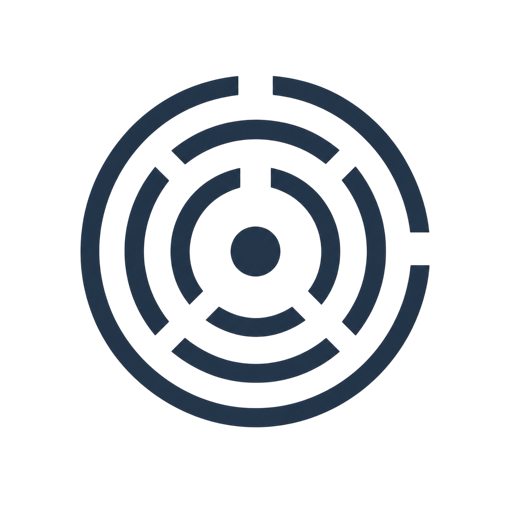

<div align="center">
  

  # TryLapse

  **Pre-launch readiness, observed.**

  *Send AI personas through your product before your users do.*

  [](https://github.com/Lapse-AI/TryLapse/actions/workflows/ci.yml)
  [](LICENSE)
  [](launch-rehearsal/tests)

  [**Live demo →**](https://trylapse-production.up.railway.app) · [Quick start](#quick-start) · [How it works](#how-it-works) · [Docs](docs/)

</div>

---


<details>
<summary><b>▶ Watch the 45-second demo</b></summary>
<br>
<p align="center">
<video src="https://github.com/user-attachments/assets/4b740da4-3ef7-4e08-ab45-01072cdbd7b1" controls muted playsinline width="100%"></video>
</p>
</details>

---

## What is TryLapse?

TryLapse is a pre-launch rehearsal tool. Before you promote a build, TryLapse sends synthetic AI personas through your product's critical user journeys — login, checkout, onboarding, export — and tells you exactly what broke, what worked, and whether you're ready to ship.

Every finding is backed by a screenshot, a DOM snapshot, and the network event that triggered it. Nothing is invented. If the agent can't show you evidence, it doesn't file the issue.

```
$ rehearse run -c my-app.yaml -o artifacts --llm

→  Crawling 48 pages…
✓  Sitemap built · 48 routes discovered
→  Spawning 4 persona agents
→  [power-user]        Login → Dashboard → Checkout
→  [new-user]          Signup → Onboarding → First action
→  [mobile-user]       iOS Safari · Checkout flow
→  [enterprise-admin]  SSO → Team management → Export

✗  [mobile-user]  Checkout form FAILED · silent submit error
   evidence: screenshot + DOM snapshot saved

✓  Readiness score: 78/100 · Amber band
✓  Run complete · 8m 24s · $0.03 agent cost
```

Observe and score only — **no auto-fix, no deploy.** TryLapse tells you what's wrong; you decide what to do about it.

---

## Why

Manual QA doesn't scale with release velocity, and most teams ship on "it worked when I clicked through it." TryLapse is the check that runs *before* that — a synthetic team of users with different devices, network conditions, and behavioral biases, rehearsing your product's critical paths and handing you an evidence-backed readiness score instead of a vibe.

- **Evidence-bound.** Every issue ships with a screenshot, DOM path, and network trace — reviewable in seconds, not re-investigated from scratch.
- **Persona-driven.** A power user, a first-time signup, a mobile user on slow 3G, and an enterprise admin don't hit the same bugs. TryLapse runs all of them.
- **A gate, not a monitor.** This runs against staging before you ship — it's a pre-launch check, not production APM.

---

## Quick start

```bash
git clone https://github.com/Lapse-AI/TryLapse.git
cd TryLapse
pip install -e ./launch-rehearsal
cd Frontend_V1 && npm install

# From repo root
./rehearse init                                    # scaffold a config from a URL
./rehearse run -c launch-rehearsal/examples/enterprise-authenticated.yaml --llm
./rehearse serve -o launch-rehearsal/artifacts      # dashboard at :8765

cd Frontend_V1 && npm run dev                       # UI at :8081
```

Or skip local setup entirely — **[try the hosted dashboard](https://trylapse-production.up.railway.app)**, sign up, and TryLapse auto-runs your first rehearsal the moment you finish onboarding.

---

## How it works

TryLapse runs a five-phase pipeline against your staging URL:

| Phase | What happens |
|---|---|
| **1. Crawler** | Playwright-powered deep crawl. Builds a route graph, identifies auth-gated routes, detects hub pages. |
| **2. Workflow detection** | Pattern-matches the crawl output to discover journeys you may not have explicitly defined. |
| **3. Journey runner** | Executes each journey end-to-end. Captures screenshots, DOM snapshots, network events, and Web Vitals at every step. |
| **4. Persona agents** | Each agent re-runs the journeys through the lens of a specific user archetype (device, viewport, auth state, behavioral bias). Agents file issues with severity and evidence, and capture delights too. |
| **5. Synthesizer** | Deduplicates findings, computes the 8-axis readiness score, writes the scorecard. |

### The 8-axis readiness score

| Axis | What it checks |
|---|---|
| Auth & Security | Login, SSO, session handling, token expiry |
| Core Flows | The product's primary value-delivering journeys |
| Performance | LCP, CLS, FID across personas and viewports |
| Accessibility | WCAG AA compliance, keyboard paths, screen reader |
| Error Handling | Network errors, invalid input, edge states |
| Conversion | Friction in signup, checkout, activation |
| Onboarding | First-run experience, time-to-value |
| Integration | Third-party deps, webhooks, export/import |

A **P0 in any dimension pulls the launch gate to CAUTION or BLOCKED regardless of the composite score.** A silent checkout failure is not acceptable at any readiness level.

### Severity levels

| Severity | Meaning |
|---|---|
| **P0** | Journey completely blocked. Fix before any promotion. |
| **P1** | Journey completes with significant defect — data loss risk, major a11y gap. Fix before launch. |
| **P2** | Non-blocking but noticeable. Fix in the next sprint. |
| **P3** | Observation or low-priority improvement. Track in backlog. |

---

## Evidence, not assertions

Every issue includes:
- A screenshot from the moment of failure
- The DOM element path and the action taken
- The persona, journey, and step number
- The observed vs. expected outcome
- The network request/response, if a form submission was involved

If an agent cannot produce this evidence, it does not file the issue.

---

## Configuration

A rehearsal is defined in a single YAML file:

```yaml
# my-app.yaml
run:
  target_url: "https://staging.my-app.com"
  product_name: "my-saas"
  viewports: [desktop, tablet, mobile]

crawl:
  enabled: true
  max_pages: 24
  supplement_journeys: true

personas:
  - id: power-user
    name: "Power user"
    role: "experienced user"
    goals: ["Complete core tasks efficiently", "Explore advanced features"]

journeys:
  - id: checkout
    name: "Add item to cart, complete purchase"
    steps:
      - action: navigate
        url: "{target_url}/products"
      - action: click
        intent: "Add to cart"
```

```bash
rehearse run -c my-app.yaml -o artifacts --llm
```

Output: a readiness score, a launch gate (PASS / REVIEW / CAUTION / BLOCKED), a blocker list with evidence, and a dashboard at `localhost:8765`.

---

## Architecture

```
TryLapse/
├── launch-rehearsal/          Python CLI + agent pipeline + dashboard API
│   ├── src/rehearse/          Crawler, journey runner, persona agents, synthesizer
│   │   └── dashboard/         Local HTTP server — SQLite-backed jobs/auth/workspaces
│   └── tests/                 365 tests
├── Frontend_V1/                React + TanStack Start dashboard
├── docs/                       Architecture, API reference, deployment guide
└── rehearse                    Repo-root CLI wrapper
```

**Stack:** Python CLI · Playwright browser automation · custom HTTP server (stdlib, no framework) · SQLite (WAL mode) · React 19 + TanStack Router/Start · DeepSeek / NVIDIA NIM for persona reasoning and narrative synthesis.

More detail: [ARCHITECTURE.md](docs/ARCHITECTURE.md) · [API_REFERENCE.md](docs/API_REFERENCE.md) · [DEPLOYMENT.md](docs/DEPLOYMENT.md)

---

## Honest about what it is

**TryLapse is:**
- A working CLI you can run today against a staging URL
- An AI-powered exploration tool that catches issues manual testing misses
- Evidence-bound — every finding is anchored to observable artifacts
- A pre-deploy gate, not a post-deploy monitor

**TryLapse is not:**
- A replacement for human QA — it catches a different class of issue, not all issues
- A guarantee your product is bug-free — it is a readiness signal, not a certification
- Magic — it works best on products with stable staging environments
- Perfectly accurate — agents can misinterpret UI elements; review reports before filing tickets

The right mental model: a teammate who runs through your product before every release, files detailed bug reports, and gives you a confidence score. Faster than a human, works at 3am, costs a few cents per run. Occasionally misreads a disabled button as a blocker. Needs human review before acting on findings.

---

## Contributing

Contributions are welcome — see [CONTRIBUTING.md](CONTRIBUTING.md) for the branch/PR workflow, and [CHANGES.md](CHANGES.md) for release history.

```
1. Branch from main:  feat/…, fix/…, or chore/…
2. Open a PR — CI runs the Python test suite + frontend build
3. Squash merge to main
```

## License

Source-available under the [PolyForm Noncommercial License 1.0.0](LICENSE). You may use, run, and modify this code for noncommercial purposes. **Commercial use requires a separate license** — contact [Lapse AI](https://github.com/Lapse-AI) to discuss commercial terms.

---

<div align="center">
  <sub>Built by <a href="https://github.com/Lapse-AI">Lapse AI</a></sub>
</div>
