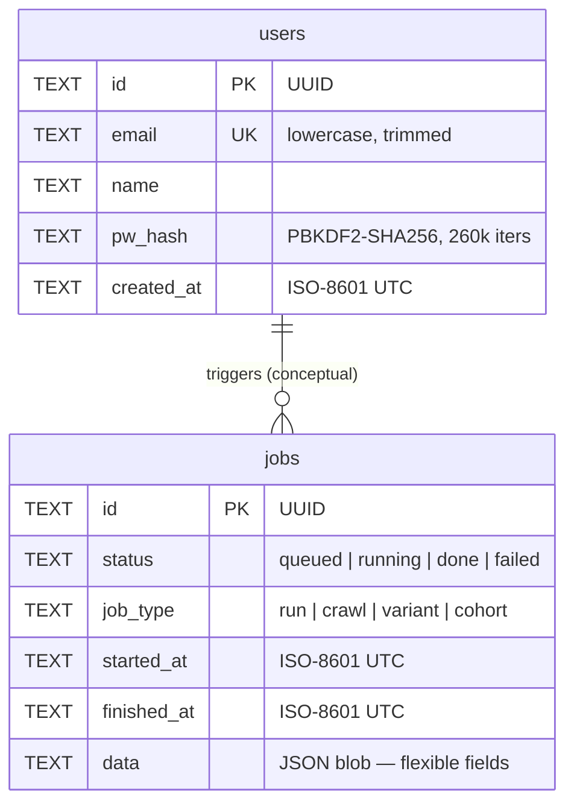

# Database Diagram

All persistent state lives in a single **SQLite** file at `/data/artifacts/jobs.db`.

WAL (Write-Ahead Logging) mode is enabled for safe concurrent reads.

---

## Entity-Relationship Diagram



> The foreign-key link between `users` and `jobs` is **conceptual** — SQLite foreign keys are not enforced. Jobs store their initiating user's identity inside the `data` JSON blob when the client sends it.

---

## Table definitions

### `users`

Stores registered user accounts. Created by `POST /auth/signup`.

| Column | Type | Constraint | Notes |
|--------|------|-----------|-------|
| `id` | TEXT | PRIMARY KEY | UUID v4 |
| `email` | TEXT | UNIQUE NOT NULL | Lowercased before insert |
| `name` | TEXT | NOT NULL DEFAULT `''` | Display name |
| `pw_hash` | TEXT | NOT NULL | `pbkdf2:sha256:260000:<salt>:<hex>` |
| `created_at` | TEXT | NOT NULL | ISO-8601 with UTC timezone |

**Indexes:** `idx_users_email` on `email` (supports O(1) lookup at login).

---

### `jobs`

Tracks background run/crawl/variant/cohort jobs. Queued by the API, consumed by worker subprocesses.

| Column | Type | Constraint | Notes |
|--------|------|-----------|-------|
| `id` | TEXT | PRIMARY KEY | UUID v4 |
| `status` | TEXT | NOT NULL DEFAULT `'queued'` | `queued` → `running` → `done\|failed` |
| `job_type` | TEXT | NOT NULL DEFAULT `'run'` | `run`, `crawl`, `variant`, `cohort` |
| `started_at` | TEXT | | ISO-8601, set when status → `running` |
| `finished_at` | TEXT | | ISO-8601, set when status → `done\|failed` |
| `data` | TEXT | NOT NULL DEFAULT `'{}'` | JSON blob; fields vary by `job_type` |

**Indexes:** `idx_jobs_status`, `idx_jobs_started DESC`.

#### `data` JSON fields by job type

**`run` / `crawl`**
```json
{
  "mode": "run",
  "configPath": "artifacts/configs/lr-self.yaml",
  "runId": "lr-self-20260601-120000",
  "error": null,
  "useLlm": true
}
```

**`cohort`**
```json
{
  "mode": "cohort",
  "configPath": "...",
  "nSeeds": 7,
  "hypothesis": "...",
  "runIds": ["lr-self-001", "lr-self-002"],
  "completedSeeds": 7,
  "aggregate": {
    "readinessMean": 74.3,
    "readinessMin": 68,
    "readinessMax": 81,
    "spread": 13,
    "confidence": "medium",
    "recurringIssues": []
  }
}
```

**`variant`**
```json
{
  "mode": "variant",
  "configAPath": "...",
  "configBPath": "...",
  "hypothesis": "...",
  "userGoal": "...",
  "runIdA": "...",
  "runIdB": "...",
  "diffNarrative": { ... }
}
```

---

## File-based storage (outside SQLite)

The following are stored as plain JSON/YAML files on disk, not in the database. They live under the `/data/artifacts/` volume:

| Path pattern | Format | Description |
|-------------|--------|-------------|
| `runs/<runId>.json` | JSON | Full `RunEvidence` (steps, screenshots, web vitals) |
| `analysis/<runId>.json` | JSON | Synthesised bundle (summary, issues, delights, grades) |
| `configs/<id>.yaml` | YAML | Test configuration (personas, journeys, budgets) |
| `sitemaps/<runId>-sitemap.json` | JSON | Crawl graph (nodes/edges) |
| `sitemaps/<runId>-sitemap.md` | Markdown | Human-readable sitemap |
| `scorecards/<runId>.md` | Markdown | CLI scorecard output |
| `annotations/<runId>.json` | JSON | User annotations on a run |
| `chat/<runId>.json` | JSON | Chat thread history |
| `diffs/<runIdA>-<runIdB>.json` | JSON | Cached diff result |
| `trends.json` | JSON | Cached trend aggregate |
| `digest.json` | JSON | Cached digest |

---

## RunEvidence schema (runs/*.json)

```
RunEvidence
├── run_id          string
├── target_url      string
├── product_name    string
├── started_at      string (ISO-8601)
├── finished_at     string | null
├── duration_ms     int
├── auth_attempted  bool
├── auth_outcome    string | null
├── outcome         "running" | "complete" | "failed" | "dry_run_complete"
├── network_log_path string | null
└── steps[]
    ├── step_id         string
    ├── journey_id      string
    ├── persona_id      string
    ├── action          string  (navigate, click, fill, assert_url_contains, …)
    ├── outcome         "pending" | "pass" | "partial" | "fail"
    ├── duration_ms     int
    ├── error_phrases_found   string[]
    ├── console_errors        string[]
    ├── web_vitals      { LCP, FID, CLS, TTFB }
    ├── focus_region    { selector, bbox } | null
    └── explore_log     { action, reasoning, outcome }[]
```

---

## Analysis bundle schema (analysis/*.json)

```
RunBundle
├── summary
│   ├── readiness       int (0–100)
│   ├── stepCount       int
│   ├── passCount       int
│   ├── failCount       int
│   └── duration_ms     int
├── issues[]
│   ├── title           string
│   ├── severity        "blocker" | "friction" | "warning"
│   ├── stepId          string
│   └── detail          string
├── delights[]
│   ├── title           string
│   └── detail          string
├── personas[]
│   ├── id              string
│   └── name            string
├── matrix[]            { personaId, grade: A–F }
└── narrative           string (Markdown, LLM-generated if available)
```
