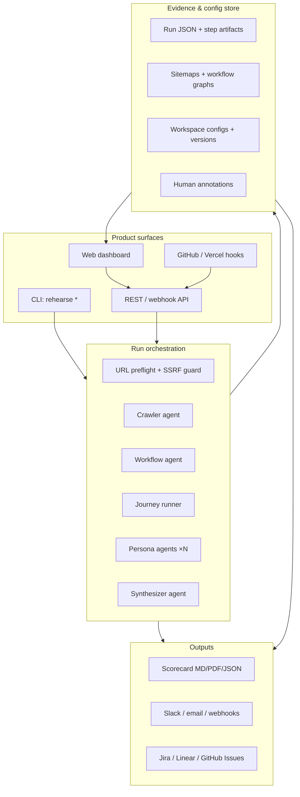
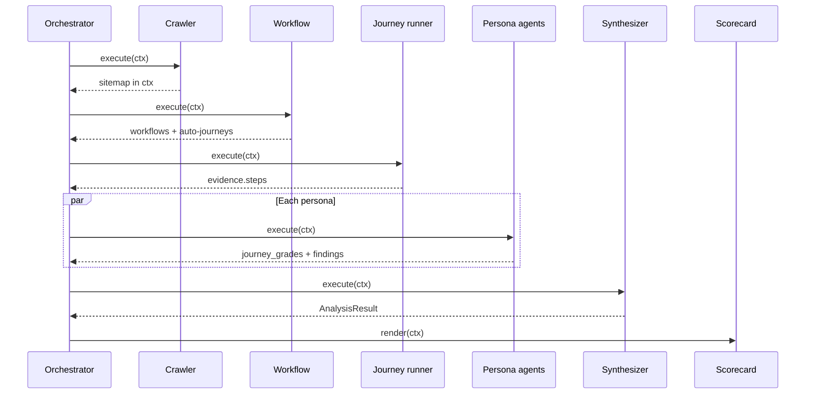
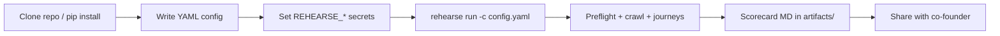

# Launch Rehearsal — Monitoring Platform Design Document

**Document type:** Product + engineering design (implementation-ready)  
**Version:** 1.0  
**Date:** May 29, 2026  
**Status:** Active — extends `MONITORING_PLATFORM_SPEC.md` with full behavioral, data, and UX nuance  
**Parent docs:** `PRODUCT.md` · `EVALUATION_FRAMEWORK.md` · `CEO_DECISIONS.md` · `MONITORING_PLATFORM_SPEC.md`  
**Reference implementation:** `../launch-rehearsal/` (Phase 1 CLI)

---

## Table of contents

1. [Executive summary](#1-executive-summary)
2. [Product context & boundaries](#2-product-context--boundaries)
3. [Design principles](#3-design-principles)
4. [System architecture](#4-system-architecture)
5. [Core data model & evidence contract](#5-core-data-model--evidence-contract)
6. [Run orchestration (backend)](#6-run-orchestration-backend)
7. [Multi-agent pipeline](#7-multi-agent-pipeline)
8. [Monitoring dashboard (primary UI)](#8-monitoring-dashboard-primary-ui)
9. [Analysis, suggestions & recommendation engine](#9-analysis-suggestions--recommendation-engine)
10. [Agent control center](#10-agent-control-center)
11. [Configuration, workspaces & journey DSL](#11-configuration-workspaces--journey-dsl)
12. [Integrations & CI/CD](#12-integrations--cicd)
13. [CLI, API & programmatic surface](#13-cli-api--programmatic-surface)
14. [Data lifecycle, security & compliance](#14-data-lifecycle-security--compliance)
15. [Non-functional requirements](#15-non-functional-requirements)
16. [Phased delivery & implementation status](#16-phased-delivery--implementation-status)
17. [User flows (end-to-end)](#17-user-flows-end-to-end)
18. [Success metrics & quality gates](#18-success-metrics--quality-gates)
19. [Open questions & decision log](#19-open-questions--decision-log)

---

## 1. Executive summary

**Launch Rehearsal** is Product A of the Synthetic Company Rehearsal platform. It gives founders and early-stage builders **synthetic customers** that exercise their web product through **end-to-end journeys**, across **multiple personas**, and produce an **evidence-bound readiness scorecard** — issues, gaps, and **required delights** — before real users exist.

This design document specifies the **monitoring product surface**: everything a user (founder, PM, eng lead) and the system (agents, CI, integrations) need to **observe, analyze, suggest, and orchestrate** rehearsal runs at scale. It covers:

- **Backend run orchestration** — crawl, journey execution, multi-agent analysis
- **Monitoring dashboard** — command center, run detail, sitemap explorer, trends, alerts
- **Analysis layer** — issue intelligence, recommendations, delight tracking
- **Agent control center** — live agent roster, collaboration trace, human-in-the-loop
- **Configuration & workspaces** — multi-product portfolio, YAML DSL, secrets
- **CLI + API + enterprise integrations**

**What this is not:** a tool that fixes, deploys, or patches the customer's product. Launch Rehearsal **observes, scores, and reports only** (`CEO_DECISIONS.md` §8).

**The monitoring platform sits **above** the shared rehearsal engine. Phase 1 ships the engine as a CLI (`rehearse run`); Phase 2+ wraps it in a web dashboard, API, and integrations described here.



---

## 2. Product context & boundaries

### 2.1 Problem statement

Pre-launch builders cannot answer: *"Without real customers, how do I know it works or what breaks?"* Manual QA and page checklists miss persona-specific friction, chronic-use gaps, and positive signals founders need for launch messaging.

### 2.2 Primary user (Phase 2 dashboard ICP)

| Attribute | Detail |
|-----------|--------|
| Who | Founder, PM, design engineer, solo builder |
| Stage | Pre-launch → early beta (<50 real users) |
| Trigger | About to launch, open beta, post-release uncertainty |
| Success | Runs rehearsal before every release; trusts scorecard |

### 2.3 Evaluated artifact vs context

| Layer | Role in Launch Rehearsal |
|-------|--------------------------|
| **Target product** (customer URL) | **Primary subject** — all journeys, issues, delights |
| Synthetic company (Slack, Jira, CRM) | **Context only** in Product A; Phase 3+ integration mocks |
| Launch Rehearsal platform | Observer — never mutates target |

### 2.4 Relationship to Product B (Deal Rehearsal)

Same core engine; different packaging later (prospect stack ingest, SE scorecard, champion delights). This design **tags features** `core` | `product_a` | `product_b`. Product B reuses §6–§14 with prospect-specific personas and stack YAML — out of scope until Mar 2027 PMF gate.

### 2.5 Competitive positioning (design constraint)

Differentiate on **believable E2E scorecards with delights**, not "agent gym" or SOC2 claims. Every UX choice should reinforce **trust** over **coverage breadth** (`CEO_DECISIONS.md`).

---

## 3. Design principles

| Principle | Design implication | Anti-pattern |
|-----------|-------------------|--------------|
| **Observe, don't modify** | No deploy hooks that patch target; suggestions are text + evidence links only | Auto-fix PRs to customer repo |
| **Evidence-bound** | Every issue/delight/gap requires `run_id` + `step_id` + artifact; scorecard generator rejects orphan findings | LLM prose without replay link |
| **Persona × journey E2E** | Matrix is mandatory UI element; single happy-path runs marked incomplete | Page crawl checklist as "full run" |
| **Multi-agent collaboration** | Agent roster, handoff artifacts, per-agent findings visible before synthesis | Black-box single LLM call |
| **Enterprise-agnostic** | Config-driven URL, auth, journeys; no hardcoded product assumptions | Cal.com-specific logic in core |
| **Delights are first-class** | Empty delights section = failed run / blocked publish | Bugs-only report |
| **Honesty bounds** | Confidence labels (`high` vs `hypothesis`); synthetic ≠ real users | "Users will love" without evidence |
| **Sell trust, not coverage** | Phase 1: 3 auto dimensions; manual slots for rest | Ship 8 dimensions with flaky automation |

---

## 4. System architecture

### 4.1 Logical components

| Component | Responsibility | Phase |
|-----------|---------------|-------|
| **Preflight service** | HEAD/GET probe, SSRF blocklist, redirect cap | 1 ✓ |
| **Crawler** | Same-origin BFS, sitemap, hub/orphan/auth detection | 1 ✓ |
| **Workflow classifier** | Pattern tags (auth, pricing, admin, search, docs, dashboard) | 1 ✓ |
| **Journey generator** | Auto-journey supplementation from crawl graph | 1 ✓ |
| **Journey runner** | Playwright E2E, step artifacts, budgets | 1 ✓ |
| **Persona evaluators** | Per-lens re-grading + findings | 1 ✓ (heuristic) |
| **Synthesizer** | Dedupe, prioritize, readiness rollup | 1 ✓ |
| **Scorecard engine** | Markdown/JSON render, evidence validation | 1 ✓ |
| **Run API** | Trigger, status, fetch artifacts | 2 |
| **Dashboard web app** | Command center, explorers, trends | 2 |
| **Annotation service** | Human agree/disagree, false positive tracking | 2 |
| **Alert dispatcher** | Slack, email, webhooks | 3 |
| **Workspace service** | Multi-product, RBAC, config versioning | 3 |
| **Compliance agent** | PII/auth boundary signals | 2 |
| **Performance agent** | Web Vitals, latency | 2 |
| **LLM persona agent** | Natural-language journey reasoning | 2 |

### 4.2 Deployment topology (Phase 2 target)

```
┌─────────────────────────────────────────────────────────────┐
│  CDN + static dashboard (Next.js or similar)                 │
└───────────────────────────┬─────────────────────────────────┘
                            │ HTTPS
┌───────────────────────────▼─────────────────────────────────┐
│  API gateway (auth, rate limits, workspace scoping)          │
└───────────┬─────────────────────────────┬───────────────────┘
            │                             │
┌───────────▼──────────┐      ┌───────────▼──────────────────┐
│  Control plane        │      │  Run workers (queue)          │
│  - workspaces         │      │  - Playwright pools           │
│  - configs            │      │  - agent orchestration        │
│  - schedules          │      │  - artifact upload            │
└───────────┬──────────┘      └───────────┬──────────────────┘
            │                             │
            └─────────────┬───────────────┘
                          ▼
              ┌───────────────────────┐
              │  Object storage (S3)   │
              │  - screenshots         │
              │  - run JSON            │
              │  - sitemaps            │
              └───────────────────────┘
              ┌───────────────────────┐
              │  Postgres             │
              │  - run metadata index  │
              │  - annotations         │
              │  - alert rules         │
              └───────────────────────┘
```

**Phase 1 today:** single-process CLI, local `artifacts/` directory — same logical model, no queue.

### 4.3 Run lifecycle state machine

```
CREATED → PREFLIGHT → [CRAWLING] → JOURNEY_EXEC → PERSONA_ANALYSIS → SYNTHESIS → SCORECARD → COMPLETE
                ↓           ↓            ↓              ↓                ↓
             FAILED      FAILED       FAILED         FAILED           FAILED
```

- `[CRAWLING]` skipped when `--no-crawl` or `crawl.enabled: false`
- `FAILED` preserves partial evidence; scorecard may render with `outcome: partial`
- `FLAKY` flag (Phase 2): parallel seeds disagree → run marked `complete_with_flake`

---

## 5. Core data model & evidence contract

### 5.1 Identity hierarchy

```
workspace_id
  └── product_id (target URL family)
        └── environment_id (staging | prod-canary | demo)
              └── run_id (e.g. cal-20260529-193724)
                    └── step_id (e.g. j2-signup-path-p1-evaluator-s1)
                          └── artifacts[] (screenshot.png, snapshot.txt)
```

### 5.2 Run record (`RunEvidence` — implemented)

| Field | Type | Required | Notes |
|-------|------|----------|-------|
| `run_id` | string | ✓ | `{prefix}-{YYYYMMDD-HHMMSS}` |
| `target_url` | string | ✓ | Normalized origin |
| `product_name` | string | ✓ | Display label |
| `config_hash` | string | Phase 2 | SHA256 of resolved YAML |
| `environment` | enum | Phase 2 | staging / prod-canary / demo |
| `started_at` | ISO8601 | ✓ | UTC |
| `finished_at` | ISO8601 | ✓ | |
| `duration_ms` | int | ✓ | Wall clock |
| `outcome` | enum | ✓ | `complete` \| `partial` \| `failed` \| `complete_with_flake` |
| `auth_attempted` | bool | ✓ | |
| `auth_outcome` | string? | | `success` \| `failed` \| `skipped` |
| `cost_estimate_usd` | float | Phase 2 | LLM + compute |
| `steps` | StepSnapshot[] | ✓ | |

### 5.3 Step snapshot (`StepSnapshot` — implemented)

Each journey step produces one record. **Evidence binding rule:** findings MUST reference existing `step_id` or explicit sentinel (`crawl-graph`, `auth-setup`) defined in schema.

| Field | Purpose |
|-------|---------|
| `step_id` | Unique within run: `{journey_id}-{persona_id}-{seq}` |
| `journey_id` / `journey_name` | Matrix row |
| `persona_id` | Matrix column (runner may tag first persona; persona agents re-grade all) |
| `action` | `navigate` \| `click` \| `fill` \| `wait` \| `assert_url_contains` |
| `requested_url` / `final_url` | Redirect detection |
| `page_title` | Information clarity heuristics |
| `http_status` | 4xx/5xx → P1/P2 |
| `outcome` | `pass` \| `partial` \| `fail` |
| `duration_ms` | Speed / friction signal |
| `body_text_excerpt` | First ~2KB text for heuristics |
| `unlabeled_button_count` | A11y / UX signal |
| `link_count`, `heading_count`, `input_count`, `labeled_input_count` | Structure metrics |
| `error_phrases_found` | "Something went wrong", etc. |
| `console_errors` | Browser console capture |
| `network_failures` | Failed XHR/fetch URLs |
| `artifact_paths` | Relative paths to PNG, text snapshots |
| `aria_metrics` | Phase 2 — focus order, role counts |
| `web_vitals` | Phase 2 — LCP, INP, CLS |

### 5.4 Finding & delight schemas

```typescript
interface Finding {
  id: string;              // I1, I2, … assigned at synthesis
  severity: "P0" | "P1" | "P2" | "P3";
  title: string;
  detail: string;
  persona_ids: string[];
  step_id: string;         // REQUIRED — CEO gate
  confidence: "high" | "hypothesis";
  dimensions: string[];    // EVALUATION_FRAMEWORK tags
  suggested_owner?: "frontend" | "backend" | "content" | "security";
  recurrence_key?: string; // Phase 3 — stable hash for trend matching
}

interface Delight {
  id: string;              // D1, D2, …
  title: string;
  detail: string;
  persona_ids: string[];
  step_id: string;         // REQUIRED
  voice_of_user?: string;  // Phase 2 LLM — quote grounded in steps
  type: "love" | "impressive" | "time_saved";
}
```

**P0** reserved for launch blockers (auth completely broken, data loss). Phase 1 heuristics primarily emit P1–P3.

### 5.5 Sitemap model (`SiteMap`)

| Field | Description |
|-------|-------------|
| `origin` | Base URL |
| `pages[]` | `{ path, title, depth, link_count, form_count, word_count, http_status }` |
| `hub_paths` | Top N by outbound links |
| `orphan_paths` | Pages with no inbound links from crawl |
| `auth_gated_paths` | Redirect to login detected |
| `error_paths` | 404/5xx in crawl |

Exports: JSON (machine), Markdown (human), GraphML (Phase 2 — graph UI).

### 5.6 Workflow graph

```typescript
interface WorkflowNode {
  workflow_type: "authentication" | "pricing" | "admin" | "search" | "documentation" | "dashboard" | "integration";
  path: string;
  title: string;
  signals: string[];       // e.g. "1 forms, 3 inputs, auth-gated"
  coverage: "none" | "partial" | "full";  // journey coverage — dashboard
}

interface SuggestedJourney {
  id: string;              // auto-j1-dashboard
  name: string;
  target_path: string;
  rationale: string;
}
```

### 5.7 Agent report (`AgentReport`)

| Field | Description |
|-------|-------------|
| `agent_id` | e.g. `crawler`, `persona-p1-evaluator`, `synthesizer` |
| `agent_role` | Human-readable |
| `phase` | `crawl` \| `workflow` \| `journey` \| `persona` \| `synthesize` |
| `status` | `running` \| `done` \| `failed` |
| `started_at` / `duration_ms` | Cost accounting |
| `summary` | One-line for scorecard table |
| `findings` / `delights` | Pre-synthesis contributions |
| `journey_grades` | `{ journey_id: { persona_id: status } }` |
| `metadata` | Handoff stats (pages crawled, merge counts) |

### 5.8 Analysis result (`AnalysisResult`)

| Field | Description |
|-------|-------------|
| `readiness` | `Red` \| `Amber` \| `Green` |
| `journey_matrix` | Persona × journey grades |
| `issues` / `delights` | Post-synthesis lists |
| `dimensions` | `{ name: [score 1-5, top signal] }` |
| `top_blocker` / `top_delight` | Executive summary |
| `gaps` | Phase 2 — chronic / veteran wishes |
| `flake_report` | Phase 2 — seed disagreement details |

**Readiness algorithm (current heuristic):**

- **Red:** any P1, or >2 journey cells `fail`, or auth failed when required
- **Amber:** P2 issues or >25% matrix cells `partial`
- **Green:** otherwise (still may have P3 polish items)

---

## 6. Run orchestration (backend)

### 6.1 Crawl & discovery

#### 6.1.1 BFS crawler (implemented)

| Parameter | Default | Description |
|-----------|---------|-------------|
| `crawl.enabled` | `true` | Master switch |
| `crawl.max_depth` | `2` | Link depth from seed |
| `crawl.max_pages` | `30` | Hard budget |
| `crawl.same_origin_only` | `true` | SSRF complement |
| `crawl.respect_robots` | `false` (Phase 2) | Optional robots.txt |
| `crawl.seed_urls` | `[target_url]` | Phase 2 — multi-seed |

**Behavior:**

1. Normalize URLs (strip fragments, trailing slashes policy)
2. Queue BFS; skip binary/media extensions
3. Per page: title, link extraction, form/input counts, word count, status code
4. Detect auth-gated: redirect to `/login`, `/auth`, `/signin` patterns
5. Classify hubs (outbound link count) and orphans (no inbound)
6. Emit sitemap JSON + Markdown

**Edge cases:**

- SPAs with client routing: use Playwright `networkidle` wait; may under-crawl without sitemap.xml seed (Phase 2)
- Infinite calendar/date URLs: path pattern denylist (Phase 2)
- Rate limiting: configurable delay between requests

#### 6.1.2 Crawl diff between runs (Phase 2)

Compare run N vs N-1 sitemaps:

| Change type | UI treatment |
|-------------|--------------|
| New page | Green node |
| Removed page | Gray strikethrough |
| Title/word count Δ > threshold | Amber "changed" badge |
| New auth-gated path | Red alert |

#### 6.1.3 Subdomain / multi-tenant URL sets (Phase 2)

`crawl.allowed_hosts[]` — explicit allowlist beyond same-origin. Required for `app.example.com` + `docs.example.com`.

#### 6.1.4 Authenticated crawl (partial — implemented)

Flow:

1. If `auth` block present in YAML, perform login before crawl
2. Credentials **only** via env vars (`REHEARSE_EMAIL`, `REHEARSE_PASSWORD`) — never YAML
3. Session cookies persist in browser context for crawl + journeys
4. Report `auth_outcome` on run record

**SSO / OAuth test accounts:** Phase 2 — manual cookie injection or stored session vault.

### 6.2 Journey execution

#### 6.2.1 Journey DSL (implemented)

**Required config shape:**

- Exactly **3 personas**, **5 journeys** (CEO Phase 1 mandate)
- Steps use allowed actions: `navigate`, `click`, `fill`, `wait`, `assert_url_contains`

**Step fields:**

| Field | Actions | Notes |
|-------|---------|-------|
| `url` | navigate | Supports `{target_url}` template |
| `intent` | click | Natural language → Playwright locator (AI-assisted Phase 1) |
| `selector` | click, fill | Optional explicit CSS/role |
| `value` | fill | Supports `${ENV_VAR}` injection |

**Example:**

```yaml
journeys:
  - id: j2-signup-path
    name: Start signup path
    steps:
      - action: navigate
        url: "{target_url}/"
      - action: click
        intent: Sign up
```

#### 6.2.2 Secret injection

- Pattern: `${REHEARSE_PASSWORD}` in step values
- Missing env → `ConfigError` at load time (fail fast)
- Dashboard: secrets manager UI writes to worker env, never stores in config DB plaintext (Phase 3 — customer-managed keys)

#### 6.2.3 Run budgets (implemented)

| Budget | Default | Exceeded behavior |
|--------|---------|-------------------|
| `max_steps_per_journey` | 20 | Truncate journey, mark `partial` |
| `max_run_seconds` | 1800 | Stop run, preserve evidence |
| `step_timeout_ms` | 30000 | Step `fail`, continue if budget allows |

#### 6.2.4 SSRF-safe URL preflight (implemented)

Before browser launch:

1. Resolve DNS for target host
2. Reject private IP ranges (10.x, 172.16–31, 192.168.x, 127.x, link-local)
3. HEAD request with redirect cap (max 5)
4. Reject non-http(s) schemes

#### 6.2.5 Per-step capture (implemented)

Each step produces:

- Screenshot PNG (full viewport)
- Text snapshot (body excerpt)
- Console + network error lists
- Timing metadata

**Phase 2 additions:** ARIA tree snapshot, HAR excerpt, Web Vitals.

#### 6.2.6 Parallel journey seeds + FLAKY flag (Phase 2)

- Run same journey 3× with different browser seeds
- Compare outcome + key metrics
- Disagreement → `FLAKY` on journey cell + run-level `complete_with_flake`
- Dashboard: flake rate trend (§8.5)

#### 6.2.7 Repeat micro-loop (Phase 1 — light)

3× repeat of designated micro-journey within single run for friction signal (`CEO_DECISIONS.md` #9). Config:

```yaml
journeys:
  - id: j6-friction-loop
    name: Export friction loop
    repeat: 3
    steps: [...]
```

#### 6.2.8 Mobile / tablet viewport profiles (Phase 2)

```yaml
run:
  viewport: desktop | tablet | mobile
  # or matrix: run all three → 3× persona matrix expansion (optional)
```

#### 6.2.9 API+UI hybrid steps (Phase 2)

```yaml
- action: api_call
  method: POST
  url: "{target_url}/api/v1/..."
  expect_status: 201
- action: navigate
  url: "{target_url}/dashboard"
  assert: UI reflects created resource
```

---

## 7. Multi-agent pipeline

### 7.1 Pipeline diagram



### 7.2 Agent specifications

#### Crawler agent (`crawl_agent`)

| Attribute | Value |
|-----------|-------|
| Phase | 1 ✓ |
| Input | `RunContext.config`, browser session |
| Output | `ctx.sitemap`, agent report |
| Handoff | Page count, hub/orphan/auth lists |

#### Workflow agent (`workflow_agent`)

| Attribute | Value |
|-----------|-------|
| Phase | 1 ✓ |
| Input | `ctx.sitemap` |
| Output | `ctx.workflows`, `ctx.auto_journey_ids` |
| Logic | URL/title/form heuristics → workflow_type; generate up to 5 auto-journeys if `supplement_journeys: true` |
| Strict mode | `strict_enterprise: true` → warn if missing pricing/docs/admin paths |

#### Journey runner agent (`journey_agent`)

| Attribute | Value |
|-----------|-------|
| Phase | 1 ✓ |
| Input | Config journeys + auto-journeys |
| Output | `ctx.evidence.steps`, screenshots |
| Note | Executes configured + auto-generated journeys sequentially |

#### Persona agents (`persona_agent` × N)

| Attribute | Value |
|-----------|-------|
| Phase | 1 ✓ heuristic; Phase 2 LLM |
| Input | Evidence + sitemap + persona definition |
| Output | Per-persona `journey_grades`, findings, delights |
| Lens rules (implemented) | Admin: network errors, auth paths; Prospect: thin content; Operator: slow steps, unlabeled buttons |

**Persona config schema:**

```yaml
personas:
  - id: p1-evaluator
    name: First-time evaluator
    role: prospect / founder
    goals:
      - Grasp product value in one scroll
    patience: medium          # Phase 2 LLM
    stress_factors: []        # Phase 2 — errors, timeouts
```

#### Synthesizer agent (`synthesizer`)

| Attribute | Value |
|-----------|-------|
| Phase | 1 ✓ |
| Merge policy | Pessimistic grade wins (`fail` > `partial` > `pass`); dedupe findings by title; re-number IDs |
| Output | `ctx.synthesis` (`AnalysisResult`) |

#### Compliance agent (Phase 2)

- Scan evidence for PII patterns in screenshots/text (optional redaction)
- Flag admin paths reachable without RBAC
- Tag `compliance_signals` dimension

#### Performance agent (Phase 2)

- Aggregate step `duration_ms`, Web Vitals
- Emit P2/P3 slowness findings with persona narrative

#### LLM persona agent (Phase 2)

- Replace/augment heuristic persona lens with goal-driven reasoning
- Must cite `step_id` for every finding — structured output schema enforced
- Budget: token cap per persona per run

### 7.3 Agent observability (Phase 2 dashboard)

| Feature | Behavior |
|---------|----------|
| Agent status stream | WebSocket/SSE: `running → done \| failed` per agent |
| Handoff payloads | Expandable JSON: `{ pages: 25, auto_journeys: 5 }` |
| Replay single agent | Re-run from agent stage using cached upstream artifacts |
| Cost + duration | Per-agent row in run detail |

### 7.4 Human override (Phase 2)

- **Annotate finding:** agree / disagree / false positive → feeds false positive rate metric
- **Manual finding:** user uploads screenshot + description → assigned temp ID, linked to run
- **Pin finding:** flag for design partner review export

---

## 8. Monitoring dashboard (primary UI)

**Phase 2 deliverable.** Design for founder-first clarity; dense information acceptable in drill-down views, not on home.

### 8.1 Information architecture

```
/                           Home — command center
/runs                       Run history list
/runs/:runId                Run detail
/runs/:runId/compare/:other Run diff
/sitemap                    Site map explorer (latest or selected run)
/workflows                  Workflow map + coverage
/trends                     Readiness & issue trends
/agents                     Agent control center (live + config)
/agents/trace/:runId        Collaboration timeline
/settings                   Workspace, env vars, integrations
/settings/journeys          YAML editor + validator
```

### 8.2 Home / command center

#### 8.2.1 Readiness gauge

| Element | Spec |
|---------|------|
| Primary widget | Large Red/Amber/Green badge per product × environment |
| Subtext | Last run timestamp, duration, issue/delight counts |
| Drill-down | Click → run detail |

#### 8.2.2 Latest run summary

- Top 3 blockers (P0/P1) with evidence links
- Top 3 delights (required visibility)
- Persona × journey matrix thumbnail (click to expand)

#### 8.2.3 Run history sparkline

- X-axis: last 30 runs
- Y-axis: readiness score (Red=0, Amber=1, Green=2) or numeric rollup
- Hover: run_id, date, top blocker

#### 8.2.4 Quick actions

| Action | Behavior |
|--------|----------|
| **Run now** | Modal: confirm config + env; queue run |
| **Crawl only** | Fast sitemap refresh without full journeys |
| **Compare last two** | Side-by-side diff view |

#### 8.2.5 Environment selector

- Tabs or dropdown: `staging` | `prod-canary` | `demo`
- Each maps to `target_url` + config variant in workspace
- Badge shows which env is "primary" for alerts

### 8.3 Run detail view

#### 8.3.1 Header metadata

`run_id`, target URL, config hash (link to config version), duration, outcome, auth status, pages crawled, agents run, cost estimate.

#### 8.3.2 Persona × journey matrix (interactive)

| Interaction | Result |
|-------------|--------|
| Click cell `Pass/Partial/Fail` | Step list for that journey × persona |
| Click journey row header | All personas for journey |
| Click persona column header | All journeys for persona |
| FLAKY badge | Show 3 seed outcomes |

Color: green / amber / red. Minimum 3 persona columns × 5 journey rows.

#### 8.3.3 Dimension rollup charts

Phase 1 (CLI): 3 automated — **Functionality**, **UI/UX**, **Information clarity**.

Phase 2+: full 8 from `EVALUATION_FRAMEWORK.md`:

- Radar chart or horizontal bar (score 1–5)
- Click dimension → filter issues list

#### 8.3.4 Issues table

| Column | Description |
|--------|-------------|
| ID | I1, I2, … |
| Severity | P0–P3 filter chips |
| Title | |
| Personas | |
| Dimension | |
| Confidence | high / hypothesis badge |
| Evidence | Link → step viewer with screenshot |
| Owner | Suggested (Phase 2) |
| Actions | Annotate, pin, export |

Default sort: severity asc, confidence desc.

#### 8.3.5 Delights section (required)

- **Cannot collapse by default** — CEO gate
- Same table shape as issues; type badge (love / impressive / time_saved)
- Marketing copy export: "Users would love…" bullet generator from selected delights

#### 8.3.6 Embedded screenshot gallery

- Grid by journey → step sequence
- Lightbox with before/after for diff runs
- Sync scroll with issue evidence link

#### 8.3.7 Side-by-side run diff

Compare run B vs run A (same journey set):

| Diff type | Visualization |
|-----------|---------------|
| New issue | Red + in B only |
| Resolved issue | Green strikethrough |
| Readiness change | Delta badge |
| Matrix cell change | Highlight changed cells |
| Delight regression | Alert if delight in A missing from B |

#### 8.3.8 Export

| Format | Contents |
|--------|----------|
| PDF | Executive summary + matrix + top issues/delights |
| Markdown | Full scorecard (CLI parity) |
| JSON | Machine-readable AnalysisResult + evidence refs |

### 8.4 Site map explorer

#### 8.4.1 Interactive graph

- Nodes = pages; edges = links discovered in crawl
- Node size ∝ outbound links (hub emphasis)
- Layout: force-directed or hierarchical by depth

#### 8.4.2 Filters

| Filter | Effect |
|--------|--------|
| Auth-gated | Purple border |
| Orphans | Dashed outline |
| Errors (4xx/5xx) | Red fill |
| Forms | Badge with form count |

#### 8.4.3 Page preview

Click node → side panel:

- Last crawl screenshot (from journey or dedicated crawl capture Phase 2)
- Title, path, metrics, workflow badges
- "Add journey from page" action

#### 8.4.4 Workflow type badges

Icons on nodes: 🔐 auth, 💰 pricing, ⚙️ admin, 🔍 search, 📄 docs

#### 8.4.5 Sitemap diff mode

Select two runs → highlight graph diffs (§6.1.2).

### 8.5 Workflow map

#### 8.5.1 Detected workflows list

Table: type, path, title, signals, **coverage indicator**.

Coverage logic:

| Coverage | Meaning |
|----------|---------|
| **Full** | ≥1 journey step navigates to path |
| **Partial** | Linked from crawled page but no dedicated journey |
| **None** | Detected but no journey touches it |

#### 8.5.2 Suggested new journeys

Workflow agent suggestions with **Accept** → appends to workspace config (PR-style review in Phase 3).

### 8.6 Trends & monitoring

| Chart | Description |
|-------|-------------|
| Readiness by dimension | Line chart over time |
| Issue recurrence | "Same blocker 3 runs in a row" banner |
| New vs resolved | Stacked bar per run |
| Flake rate | % journeys FLAKY |
| Crawl size / depth | Area chart — detect site growth |
| Scheduled runs calendar | Month view with run outcomes |

**Recurrence key:** hash of `(normalized_title, journey_id, step_pattern)` for matching across runs.

### 8.7 Alerts & notifications

| Alert type | Trigger | Channel |
|------------|---------|---------|
| Readiness drop | Green→Amber or Amber→Red | Slack, email |
| P0 issue | Any new P0 | Instant Slack + email |
| Weekly digest | Cron | Scorecard snippet + sparkline |
| CI webhook | Run complete | GitHub commit status, Vercel |

**User-configurable thresholds** per workspace (Phase 3).

---

## 9. Analysis, suggestions & recommendation engine

### 9.1 Issue intelligence

| Feature | Behavior |
|---------|----------|
| **Severity explanation** | Expand issue → "Why P1?" — rule trace (http 500 → P1) or LLM rationale (Phase 2) |
| **Confidence label** | `high` = deterministic/heuristic; `hypothesis` = persona inference |
| **Persona impact** | "Blocks P3 admin, not P1 prospect" |
| **Similar past issues** | Search prior runs by recurrence_key |
| **Suggested owner** | Heuristic: network/console → backend; unlabeled buttons → frontend; thin copy → content |
| **No auto-fix** | Suggestion text + evidence links ONLY |

### 9.2 Recommendation engine

| Output | Description |
|--------|-------------|
| **Prioritized backlog export** | CSV / Jira / Linear / GitHub Issues with evidence URLs |
| **Fix before launch shortlist** | CEO gate style — P0/P1 + partial matrix cells |
| **Gap / wish list** | Chronic friction from repeat loops + veteran persona (Phase 3) |
| **Competitive benchmark slot** | Manual compare URL field — side-by-side readiness (Phase 3) |
| **Rubric alignment** | Every finding tagged with `EVALUATION_FRAMEWORK.md` dimensions |

### 9.3 Delights & strengths

| Rule | Detail |
|------|--------|
| Required in every scorecard | Empty → warning banner in dashboard |
| Marketing-ready quotes | Phase 2 LLM persona `voice_of_user` |
| Regression detection | Delight in run N-1 absent in N → amber alert |

### 9.4 Gaps & wishes (Phase 2+)

Separate from bugs — structured chronic user needs:

```typescript
interface Gap {
  id: string;
  description: string;
  confidence: "high" | "hypothesis";
  persona_ids: string[];
  evidence_step_ids: string[];
  veteran_signal: boolean;  // from repeat loops / 100× mode
}
```

Example from Phase 0 Argyle dogfood: *"Veteran user filtering daily would want saved filter presets"* (hypothesis).

---

## 10. Agent control center

### 10.1 Agent roster (live run)

During active run, show cards per agent:

```
┌─────────────────┐  ┌─────────────────┐  ┌─────────────────┐
│ 🕷 Crawler      │  │ 🔀 Workflow     │  │ 🎭 Persona P1   │
│ ● running       │  │ ○ queued        │  │ ○ queued        │
│ 12/30 pages     │  │                 │  │                 │
└─────────────────┘  └─────────────────┘  └─────────────────┘
```

Post-run: final status, duration, cost, summary, expandable findings.

### 10.2 Agent configuration UI

| Control | Maps to |
|---------|---------|
| Enable/disable agents | Skip compliance/performance if off |
| Persona editor | 3–7 personas (validate min 3) |
| Crawl budget sliders | max_depth, max_pages |
| Strict enterprise toggle | `strict_enterprise` |
| LLM model pick | Phase 2 — per persona agent |

### 10.3 Collaboration trace

Timeline visualization:

```
Crawler ──► Workflow ──► Journey ──► Persona×3 ──► Synthesizer
 25 pages    5 auto-j      47 steps    12 findings    8 issues
```

Click stage → handoff payload + option to **replay from here**.

### 10.4 Human-in-the-loop

See §7.4. Dashboard surfaces annotation counts; false positive rate is a **platform success metric** (§18).

---

## 11. Configuration, workspaces & journey DSL

### 11.1 Workspace model (Phase 3)

```typescript
interface Workspace {
  id: string;
  name: string;
  products: Product[];
  members: Member[];  // RBAC Phase 3
  integrations: Integration[];
}

interface Product {
  id: string;
  name: string;
  environments: Environment[];
}

interface Environment {
  id: string;
  label: "staging" | "prod-canary" | "demo";
  target_url: string;
  config_id: string;
}
```

### 11.2 YAML editor + validator

- Monaco editor with schema validation (same rules as `load_config()`)
- Inline errors: persona count, journey count, unknown actions
- **Dry run** button → preflight + DSL validate only (`rehearse run --dry-run`)

### 11.3 Config versioning

- Each save creates immutable version with hash
- Run records store `config_hash` for reproducibility
- Optional git link (GitHub repo + path) — webhook on push triggers run (Phase 3)

### 11.4 Environment variables manager

| Rule | Detail |
|------|--------|
| Storage | Encrypted at rest; injected at worker runtime |
| Naming | `REHEARSE_*` prefix convention |
| Never in YAML | Enforced by validator scanning for password patterns |

### 11.5 Journey library / templates

Vertical packs (Phase 3):

| Pack | Journeys included |
|------|-------------------|
| SaaS PLG | land, signup, pricing, invite, settings |
| E-commerce | browse, cart, checkout, return, account |
| Internal tools | login, CRUD, admin, report export |

Import: **OpenAPI** or **sitemap.xml** as crawl seed (Phase 2).

---

## 12. Integrations & CI/CD

| Integration | Phase | Use case |
|-------------|-------|----------|
| **GitHub Actions** | 2 | `rehearse run` on PR / pre-deploy; commit status |
| **Vercel / Netlify hooks** | 2 | Post-deploy rehearsal on preview URL |
| **Slack** | 3 | Alerts + scorecard snippet |
| **Jira / Linear** | 2 | Issue export from backlog |
| **Datadog / Sentry** | 2 | Correlate rehearsal network/console errors with prod |
| **SSO** | 2 | Dashboard login (Google/GitHub OIDC) |
| **RBAC** | 3 | Admin / viewer / run-only |

### 12.1 GitHub Action contract (Phase 2)

```yaml
# .github/workflows/rehearse.yml
- uses: launch-rehearsal/action@v1
  with:
    config: rehearse/staging.yaml
    api-key: ${{ secrets.REHEARSE_API_KEY }}
    fail-on: amber  # or red | p1
```

Outputs: scorecard artifact upload, PR comment with matrix summary.

### 12.2 Webhook payload (run complete)

```json
{
  "event": "run.complete",
  "run_id": "cal-20260529-193724",
  "readiness": "Amber",
  "issues_p1": 1,
  "delights": 5,
  "scorecard_url": "https://app.../runs/cal-20260529-193724",
  "compare_url": "https://app.../runs/.../compare/..."
}
```

---

## 13. CLI, API & programmatic surface

### 13.1 CLI commands

| Command | Status | Description |
|---------|--------|-------------|
| `rehearse run` | ✓ Shipped | Full pipeline |
| `rehearse crawl` | ✓ Shipped | Sitemap only |
| `rehearse scorecard` | ✓ Shipped | Regenerate from evidence JSON |
| `rehearse diff` | Planned | Compare two run IDs → diff markdown |
| `rehearse init` | Planned | Scaffold config from URL + crawl |
| `rehearse schedule` | Planned | Cron wrapper → API in Phase 3 |

**CLI output contract:** final line JSON summary (run_id, readiness, paths) for CI parsing.

### 13.2 REST API (Phase 2)

| Method | Path | Description |
|--------|------|-------------|
| POST | `/v1/workspaces/{ws}/runs` | Trigger run |
| GET | `/v1/runs/{run_id}` | Metadata + status |
| GET | `/v1/runs/{run_id}/scorecard` | Markdown or JSON |
| GET | `/v1/runs/{run_id}/evidence` | Step list |
| GET | `/v1/runs/{run_id}/artifacts/{path}` | Signed URL |
| POST | `/v1/runs/{run_id}/annotations` | Human feedback |
| GET | `/v1/products/{id}/trends` | Aggregated metrics |

Auth: API key per workspace; OAuth for dashboard.

---

## 14. Data lifecycle, security & compliance

### 14.1 Evidence retention

| Tier | Retention | Target user |
|------|-----------|-------------|
| Free | 30 days | Trial |
| Pro | 90 days | Paying founder |
| Team | 365 days | CI teams |

Configurable per workspace (Phase 3). Purge job deletes object storage + DB refs.

### 14.2 PII handling

- Optional redaction pass on screenshots (blur emails, addresses)
- Argyle Phase 0 surfaced PII density as **compliance signal** (I12) — not auto-redaction
- Customer opt-in: `redact_pii: true` in run config

### 14.3 Audit log (Phase 3)

| Event | Fields |
|-------|--------|
| `run.started` | user_id, workspace, target_url, config_hash |
| `scorecard.viewed` | user_id, run_id |
| `annotation.created` | user_id, finding_id, verdict |
| `config.updated` | user_id, version |

SOC2-ready storage story — Phase 2 design, Phase 3 certification path.

### 14.4 Secrets

- Phase 1: local env vars only
- Phase 3: customer-managed keys (CMK) for encrypted secret blob
- Never log secret values; mask in agent traces

---

## 15. Non-functional requirements

| NFR | Target | Phase |
|-----|--------|-------|
| Time to first scorecard (new URL) | < 15 min | 2 |
| CLI run (25 pages + 10 journeys) | < 5 min | 1 ✓ (~81s Cal.com) |
| Dashboard LCP | < 2.5s | 2 |
| Run worker concurrency | 5 parallel runs / workspace Pro | 3 |
| API availability | 99.5% | 3 |
| Evidence durability | 11 nines object storage | 2 |

---

## 16. Phased delivery & implementation status

### 16.1 Phase map

| Phase | Dates | Focus | Monitoring surface |
|-------|-------|-------|-------------------|
| **0** | May 28 – Jun 7, 2026 | Manual rehearsal | Scorecard template only ✓ |
| **1** | Jun 8 – Jul 5, 2026 | CLI trust loop | §6 + §13 CLI ✓ (in progress) |
| **2** | Jul 6 – Sep 30, 2026 | Alpha + dashboard | §8, §10, §12 CI, LLM personas |
| **3** | Oct 2026 – Jun 2027 | Growth | §8.6 trends, §8.7 alerts, workspaces, billing |
| **4** | Jul 2027+ | Deal Rehearsal | Product B overlays |

### 16.2 Feature checklist vs implementation (May 29, 2026)

| Spec section | Feature | Status |
|--------------|---------|--------|
| §2.1 | BFS crawler | ✓ |
| §2.1 | Sitemap JSON/Markdown | ✓ |
| §2.1 | Hub/orphan/auth detection | ✓ |
| §2.1 | Workflow classification | ✓ |
| §2.1 | Auto-journey generation | ✓ |
| §2.1 | Crawl diff | ○ Phase 2 |
| §2.1 | Multi-tenant URL sets | ○ Phase 2 |
| §2.1 | Authenticated crawl | ✓ partial |
| §2.2 | Journey DSL | ✓ |
| §2.2 | Secret injection | ✓ |
| §2.2 | Run budgets | ✓ |
| §2.2 | SSRF preflight | ✓ |
| §2.2 | Per-step screenshots + text | ✓ |
| §2.2 | Network/console capture | ✓ |
| §2.2 | Parallel seeds + FLAKY | ○ Phase 2 |
| §2.2 | 3× micro-repeat | ○ partial |
| §2.2 | Mobile viewports | ○ Phase 2 |
| §2.3 | Agent pipeline | ✓ |
| §2.3 | Agent status stream | ○ Phase 2 |
| §2.3 | Replay single agent | ○ Phase 2 |
| §3 | Entire dashboard | ○ Phase 2 |
| §4 | Issue intelligence | ○ partial (heuristics) |
| §5 | Agent page | ○ Phase 2 |
| §6 | Workspaces | ○ Phase 3 |
| §7 | Integrations | ○ Phase 2+ |
| §8 | CLI diff/init/schedule | ○ Planned |
| §9 | Retention/audit/SOC2 | ○ Phase 2–3 |

Legend: ✓ shipped · ○ planned · partial = basic version exists

---

## 17. User flows (end-to-end)

### 17.1 First-time founder — CLI path (Phase 1)



**Time budget:** 15–30 min including config authoring.

### 17.2 Returning founder — dashboard path (Phase 2)

1. Log in → workspace home shows **Amber** readiness on staging
2. Click **Run now** → confirm config v3 → watch agent roster live
3. Run completes → notification banner
4. Review matrix → P1 city filter bug → click evidence → screenshot
5. Annotate **agree** → export to Linear
6. Pin delight D6 for launch page copy
7. Schedule weekly crawl on staging

### 17.3 CI developer — PR gate (Phase 2)

1. PR opened → GitHub Action triggers `rehearse run` on preview URL
2. Run completes → commit status **failure** if readiness Red or new P1
3. PR comment embeds matrix diff vs `main` last run
4. Engineer fixes target product → re-run → green

### 17.4 Design partner review (Phase 2)

1. Founder **pins** 3 findings + 2 delights
2. Exports **Fix before launch** PDF
3. Annotates false positive on I10 → platform tracks FP rate
4. Qualitative session: "would you run before every launch?"

---

## 18. Success metrics & quality gates

### 18.1 Platform metrics (`MONITORING_PLATFORM_SPEC.md` §11)

| Metric | Target |
|--------|--------|
| Time to first scorecard | < 15 min new URL |
| Insight quality | ≥1 non-obvious issue + ≥1 delight on dogfood URL |
| Design partner trust | 5 founders answer "would run before every launch" |
| False positive rate | Tracked via human annotations; target < 20% on P1 |

### 18.2 CEO gates (non-negotiable)

1. No delight/issue without evidence binding
2. Phase 0 pass before Phase 1 code ✓
3. No Product B before Mar 2027
4. No public pricing until 3 verbal pay commits

### 18.3 Run quality checks (automated)

Before scorecard publish:

- [ ] `len(personas) >= 3`
- [ ] `len(journeys) >= 5`
- [ ] Matrix fully populated
- [ ] ≥0 delights OR explicit `delights_manual_review_required` flag
- [ ] All findings have valid `step_id`
- [ ] Run duration within budget

---

## 18.4 Validation examples (Phase 0 dogfood)

**Argyle Faculty Dashboard** (`phase0-argyle-20260529-002`) — demonstrates design doc outputs:

| Output | Example |
|--------|---------|
| Readiness | Amber |
| P1 blocker | City filter does not apply (I6) |
| Delight | AI semantic search (D6) |
| Persona matrix | 5 journeys × 3 personas |
| Compliance signal | PII density in table (I12) |
| Gap (hypothesis) | Saved filter presets (G5) |

**Cal.com CLI run** (`cal-20260529-193724`) — demonstrates automated pipeline:

| Output | Example |
|--------|---------|
| Pages crawled | 25 |
| Auto journeys | 5 (auth, docs, search, dashboard, hub) |
| Multi-agent table | 7 agents in scorecard |
| Duration | 81s |

---

## 19. Open questions & decision log

| # | Question | Owner | Resolve by | Status |
|---|----------|-------|------------|--------|
| 1 | Dashboard framework (Next.js vs SvelteKit) | Eng | Aug 2026 | Open |
| 2 | LLM provider for Phase 2 personas | Eng | Jul 2026 | Open |
| 3 | Graph UI library for sitemap explorer | Eng | Aug 2026 | Open |
| 4 | Free tier retention 30 vs 14 days | Sparsh | Sep 2026 | Open |
| 5 | Open-source CLI core? | Sparsh | Aug 1, 2026 | CEO: closed default |
| 6 | P0 auto-escalation rules | Eng | Phase 2 kickoff | Open |

### Amendment log

| Version | Date | Change |
|---------|------|--------|
| 1.0 | May 29, 2026 | Initial design doc from `MONITORING_PLATFORM_SPEC.md` + `launch-rehearsal` implementation + Phase 0 scorecards |

---

## Related documents

| Document | Role |
|----------|------|
| [`MONITORING_PLATFORM_SPEC.md`](MONITORING_PLATFORM_SPEC.md) | Feature inventory / north star checklist |
| [`PRODUCT.md`](PRODUCT.md) | Company & product strategy |
| [`EVALUATION_FRAMEWORK.md`](EVALUATION_FRAMEWORK.md) | Rubric: personas, dimensions, delights |
| [`CEO_DECISIONS.md`](CEO_DECISIONS.md) | Phase 1 scope lock |
| [`../launch-rehearsal/README.md`](../launch-rehearsal/README.md) | CLI setup & commands |

---

*This document is the implementation blueprint for the monitoring product surface. When spec and CEO decisions conflict, CEO decisions win for Phase 1 scope; spec wins for Phase 2+ north star.*
